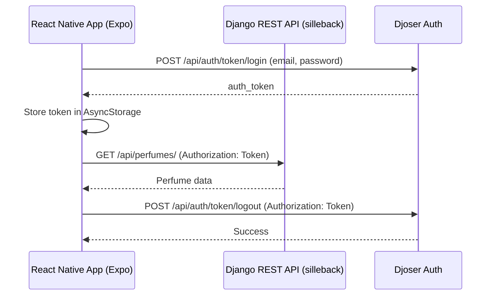

# Integration Plan: Django Backend (`silleback`) + React Native Expo Frontend (`sillefront`)

---

## Overview

This document outlines how to integrate the Django REST API backend with the React Native Expo frontend, including authentication, API calls, and configuration.

---

## 1. API Base URL Configuration

- Define the backend API base URL (e.g., `http://localhost:8000/api/`).
- Store it in environment variables or Expo config (`app.config.js` or `.env`).
- Avoid hardcoding URLs in code.

---

## 2. Authentication Flow (Djoser)

- **Login:**
  - POST `/api/auth/token/login/` with credentials.
  - Receive `auth_token`.
  - Store token securely (AsyncStorage).
- **Authenticated Requests:**
  - Add header: `Authorization: Token <auth_token>`.
- **Logout:**
  - POST `/api/auth/token/logout/` with token in header.
  - Clear stored token.
- **Registration, password reset, etc.:**
  - Use Djoser endpoints.

---

## 3. Important: Username vs Email Mismatch

- **Frontend uses:** `email` + `password` for registration/login.
- **Djoser default uses:** `username` + `password`.
- **Solution:**

Update Django `settings.py`:

```python
DJOSER = {
    'LOGIN_FIELD': 'email',
    'USER_CREATE_PASSWORD_RETYPE': True,
    'SERIALIZERS': {
        'user_create': 'djoser.serializers.UserCreateSerializer',
        'user': 'djoser.serializers.UserSerializer',
        'current_user': 'djoser.serializers.UserSerializer',
    },
}
```

- **AND** ensure your **User model** uses `email` as `USERNAME_FIELD`.
- If not yet, create a **custom user model** with `email` as username.
- This aligns backend with frontend's email-based auth.

---

## 4. API Service Module (Frontend)

- Create `src/api/api.ts` or similar.
- Functions:
  - `login(email, password)`
  - `logout()`
  - `register(email, password, extraData)`
  - `get(endpoint, params)`
  - `post(endpoint, data)`
  - `put(endpoint, data)`
  - `delete(endpoint)`
- Attach token automatically to requests.
- Use `fetch` or `axios`.

---

## 5. Token Storage

- Use `@react-native-async-storage/async-storage`.
- Load token on app start.
- Optionally, create an **AuthContext**.

---

## 6. Auth Context

- Manage:
  - `user`
  - `token`
  - `login()`, `logout()`, `register()`
  - `isAuthenticated`
- Provide globally.

---

## 7. Use API Service in Components

- Login screen calls `api.login()`.
- Protected screens check `isAuthenticated`.
- Fetch data from `/api/brands/`, `/api/perfumes/`, etc.
- Handle errors/loading.

---

## 8. Backend API Endpoints

- `/api/brands/`
- `/api/occasions/`
- `/api/accords/`
- `/api/perfumes/`
- `/api/cart/`
- `/api/boxes/predefined/`
- `/api/subscriptions/`
- `/api/orders/`
- `/api/favorites/`
- `/api/survey/`
- `/api/perfumes/<perfume_id>/rating/`
- Auth endpoints under `/api/auth/`

---

## 9. CORS Setup (Backend)

- Use `django-cors-headers`.
- Allow Expo app origin(s).
- For dev, `CORS_ALLOW_ALL_ORIGINS = True`.

---

## 10. Optional Enhancements

- Use JWT instead of token auth.
- Add refresh token flow.
- Axios interceptors.
- Unit tests.
- Role-based access.

---

## Architecture Diagram



---

## Summary

- Configure API base URL.
- Implement API service with token handling.
- Align Djoser to use **email** as login field.
- Use AuthContext.
- Use API service in components.
- Ensure CORS is configured.
- Manage environment variables.

---