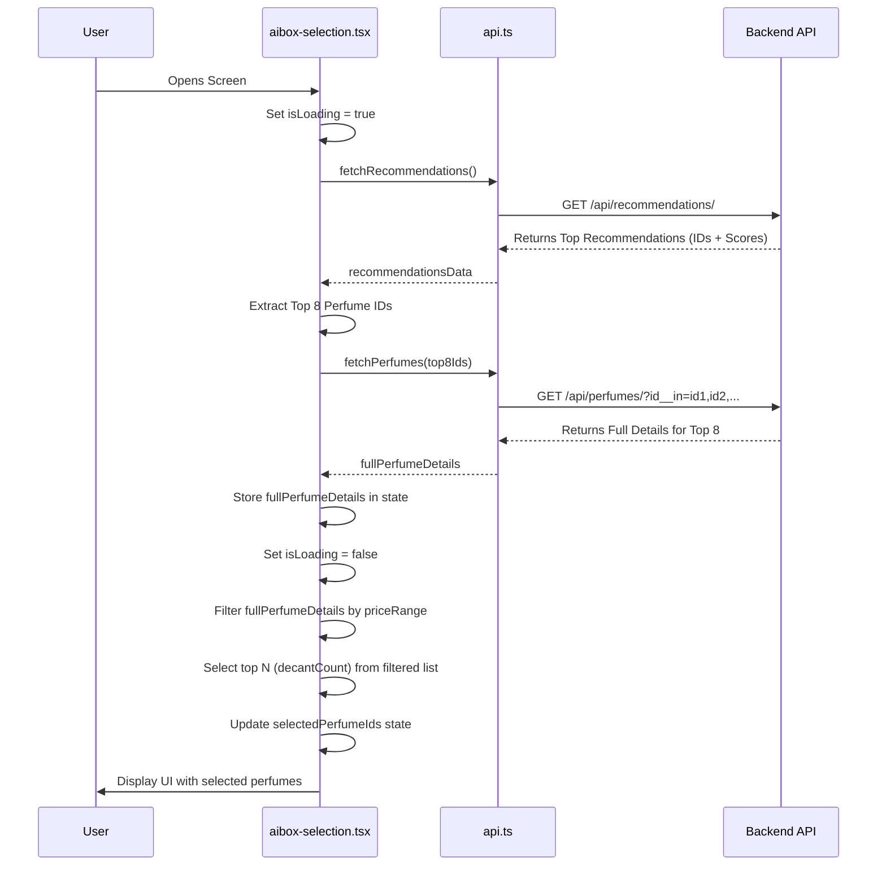

# Plan: Integrate Backend Recommendations into AI Box Selection

**Goal:** Replace the static `MOCK_PERFUMES` in `SilleFront/app/aibox-selection.tsx` with the top 8 dynamically fetched, personalized perfume recommendations for the authenticated user, allowing filtering and selection based on these recommendations.

**Phase 1: Backend Filter Check (Assumption)**

*   **Action:** Verify that the `PerfumeFilter` in `SilleBack/api/filters.py` supports filtering by a list of primary keys (e.g., using `id__in` lookup).
*   **Responsibility:** Backend Developer (or confirm if already supported).
*   **Rationale:** This is needed for the frontend's `fetchPerfumes` call in Phase 4 to efficiently retrieve details for only the recommended perfumes.

**Phase 2: Frontend Type Standardization**

*   **Action:** Modify the `Perfume` interface in `SilleFront/types/perfume.ts` to consistently use snake_case for properties that match the backend API response structure (e.g., `match_percentage`, `price_per_ml`, `overall_rating`, `top_notes`, etc.). Update `BasicPerfumeInfo` accordingly if needed.
*   **Responsibility:** Frontend (Code Mode).
*   **Rationale:** Ensures type safety and consistency when handling data fetched from the backend.

**Phase 3: API Service Enhancements (`SilleFront/src/services/api.ts`)**

*   **Action 1:** Define a new TypeScript interface `ApiRecommendation` representing the structure returned by `/api/recommendations/` (likely `{ perfume: ApiPerfumeSummary, score: number, last_updated: string }`).
*   **Action 2:** Create a new asynchronous function `fetchRecommendations(): Promise<ApiRecommendation[]>` that:
    *   Calls the `/api/recommendations/` endpoint using `GET`.
    *   Requires authentication (`createHeaders(true)`).
    *   Handles the response (using `handleResponse`).
*   **Action 3:** Modify the existing `fetchPerfumes` function:
    *   Add an optional parameter `ids?: number[]`.
    *   If `ids` is provided and not empty, add an `id__in` query parameter to the URL: `params.append('id__in', ids.map(String).join(','));`.
*   **Responsibility:** Frontend (Code Mode).
*   **Rationale:** Provides the necessary functions to fetch recommendations and their full details.

**Phase 4: AI Box Screen Implementation (`SilleFront/app/aibox-selection.tsx`)**

*   **Action 1: State Management:**
    *   Add state variables:
        *   `isLoading: boolean` (to track overall loading state).
        *   `recommendedPerfumes: Perfume[]` (to store the full details of the top 8 recommendations).
        *   `error: string | null` (to store potential API errors).
    *   Remove the direct import and usage of `MOCK_PERFUMES`.
*   **Action 2: Data Fetching Logic (`useEffect`):**
    *   Create a primary `useEffect` hook (runs on mount, potentially depends on auth state if needed).
    *   Inside the effect:
        *   Set `isLoading` to `true`, clear `error`.
        *   `try...catch` block for error handling.
        *   Call `fetchRecommendations()`.
        *   If successful, extract the `perfume.id` from the top 8 recommendations.
        *   Call `fetchPerfumes()` passing the extracted top 8 IDs.
        *   Store the returned full perfume details in the `recommendedPerfumes` state.
        *   Set `error` state if any API call fails.
        *   Finally, set `isLoading` to `false`.
*   **Action 3: Initial Selection Logic (`useEffect`):**
    *   Modify the existing `useEffect` that depends on `decantCount` and `rangoPrecio`.
    *   Make it *also* depend on the `recommendedPerfumes` state.
    *   Inside this effect:
        *   Check if `recommendedPerfumes` has data.
        *   Filter `recommendedPerfumes` based on the current `rangoPrecio`.
        *   Select the top `decantCount` perfumes from this *price-filtered recommended list*.
        *   Update the `selectedPerfumeIds` state with the IDs of these selected perfumes.
*   **Action 4: Component Updates:**
    *   Pass `recommendedPerfumes` state to the `PerfumeList` component's `perfumes` prop.
    *   Update `calculateTotalPrice`, `handleAddToCart`, `handlePerfumePress`, `handleSwapPress` to use the `recommendedPerfumes` state for finding perfume details instead of `MOCK_PERFUMES`.
*   **Action 5: UI Updates:**
    *   Render a loading indicator (e.g., `ActivityIndicator`) when `isLoading` is true.
    *   Display an error message if the `error` state is not null.
    *   Ensure the rest of the UI (DecantSelector, PriceRangeSlider, PerfumeList, BottomBar, BoxVisualizer) is displayed correctly once loading is complete and there are no errors.
*   **Responsibility:** Frontend (Code Mode).
*   **Rationale:** Implements the core logic to fetch, process, and display recommendations dynamically.

**Phase 5: Perfume Modal Update (`SilleFront/components/product/PerfumeModal.tsx`)**

*   **Action:** Review the component to ensure it correctly accesses perfume properties using the standardized snake_case naming convention established in Phase 2.
*   **Responsibility:** Frontend (Code Mode).
*   **Rationale:** Ensures the modal continues to display data correctly after the type definition changes.

## Mermaid Diagram: Data Flow



## Mermaid Diagram: Component Interaction

```mermaid
graph TD
    subgraph Screen [aibox-selection.tsx]
        A[State: isLoading, recommendedPerfumes, selectedPerfumeIds, decantCount, decantSize, rangoPrecio]
        B(useEffect: Fetch Recommendations & Details) --> A;
        C(useEffect: Update Selection) -- Reads --> A;
        C -- Updates --> A;
        D[PerfumeList] -- Uses --> A;
        E[BottomBar] -- Uses --> A;
        F[PerfumeModal Trigger] -- Uses --> A;
        G[DecantSelector] -- Updates --> A;
        H[PriceRangeSlider] -- Updates --> A;
        I[BoxVisualizer] -- Uses --> A;
    end

    subgraph API [api.ts]
        J(fetchRecommendations)
        K(fetchPerfumes)
    end

    subgraph Components
        D -- Renders --> L[PerfumeListItem];
        L -- onPress --> F;
        F -- Opens --> M[PerfumeModal];
        M -- Uses Data From --> A;
        M -- Fetches Similar --> K;
    end

    B --> J;
    B --> K;

    style A fill:#lightgrey,stroke:#333,stroke-width:1px
    style J fill:#ccf,stroke:#333,stroke-width:1px
    style K fill:#ccf,stroke:#333,stroke-width:1px